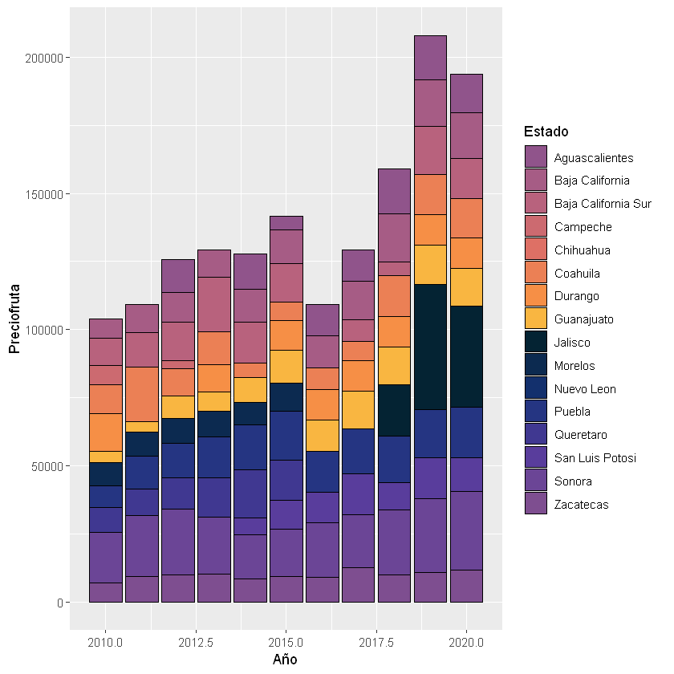
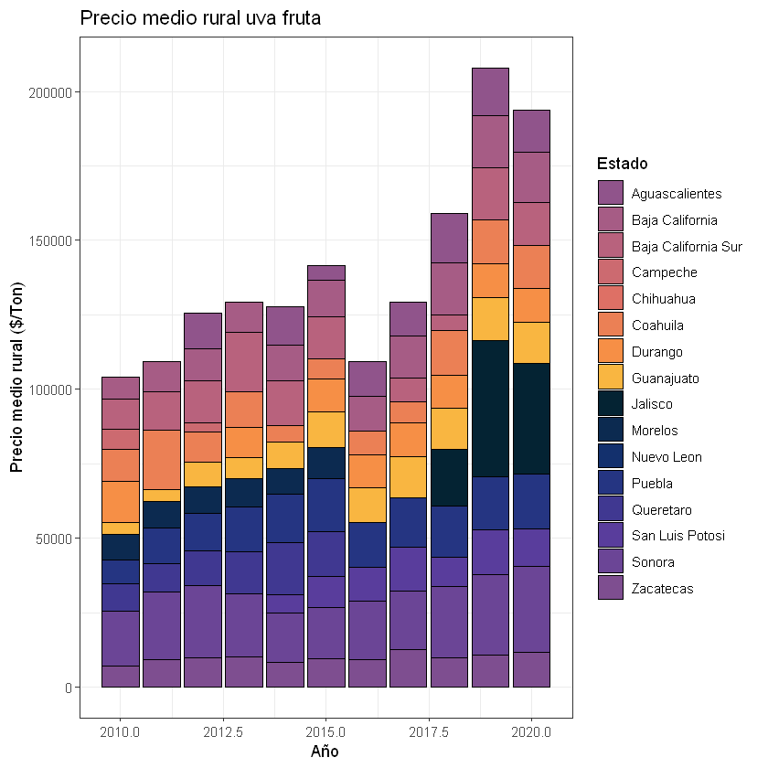
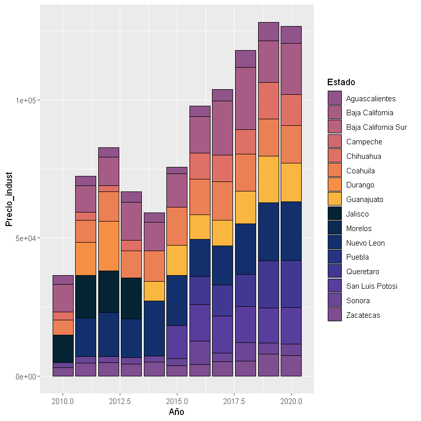
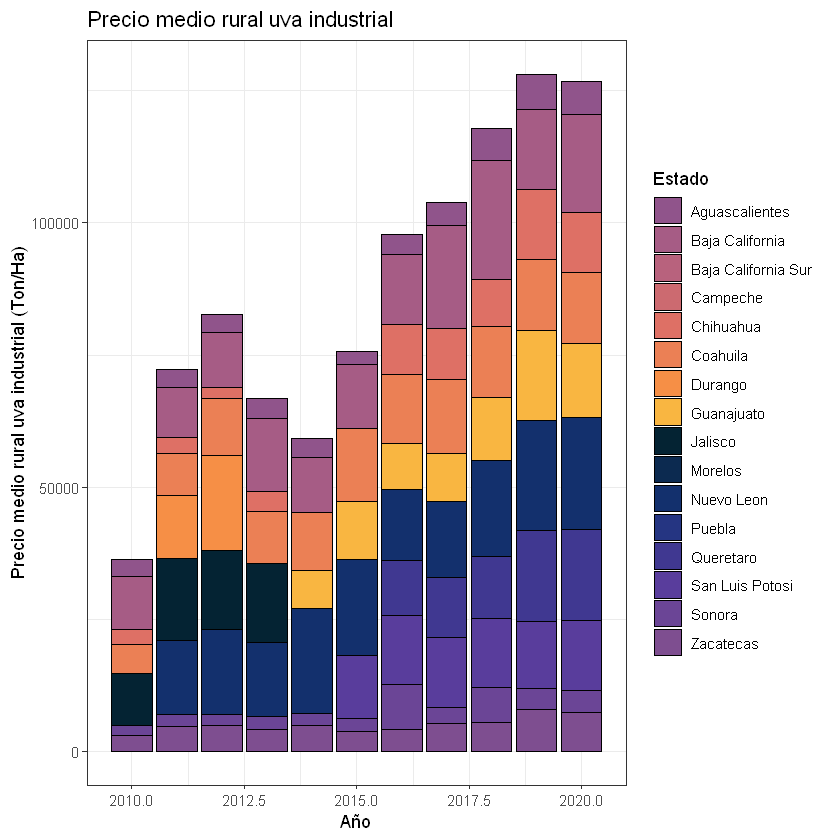
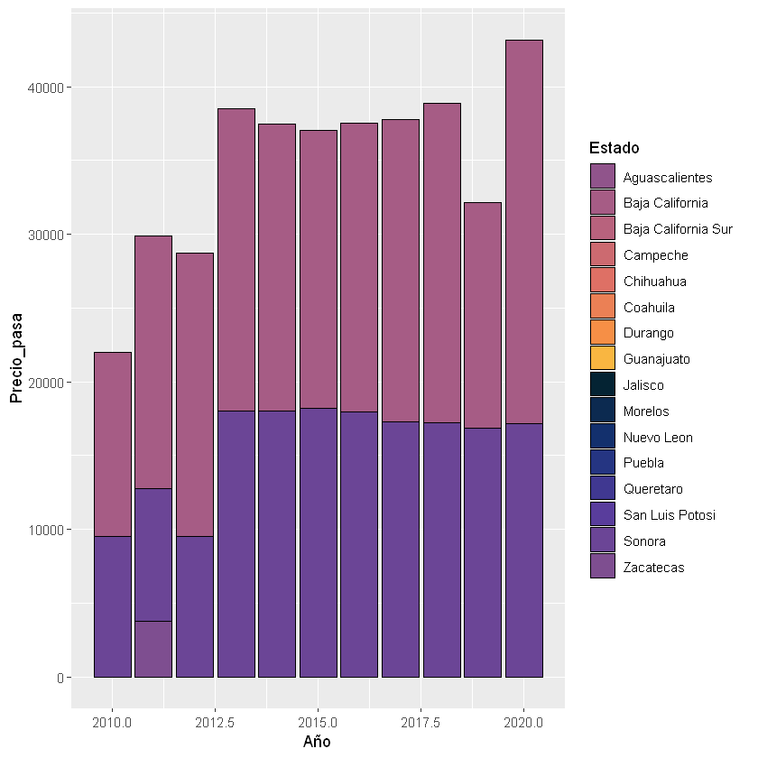
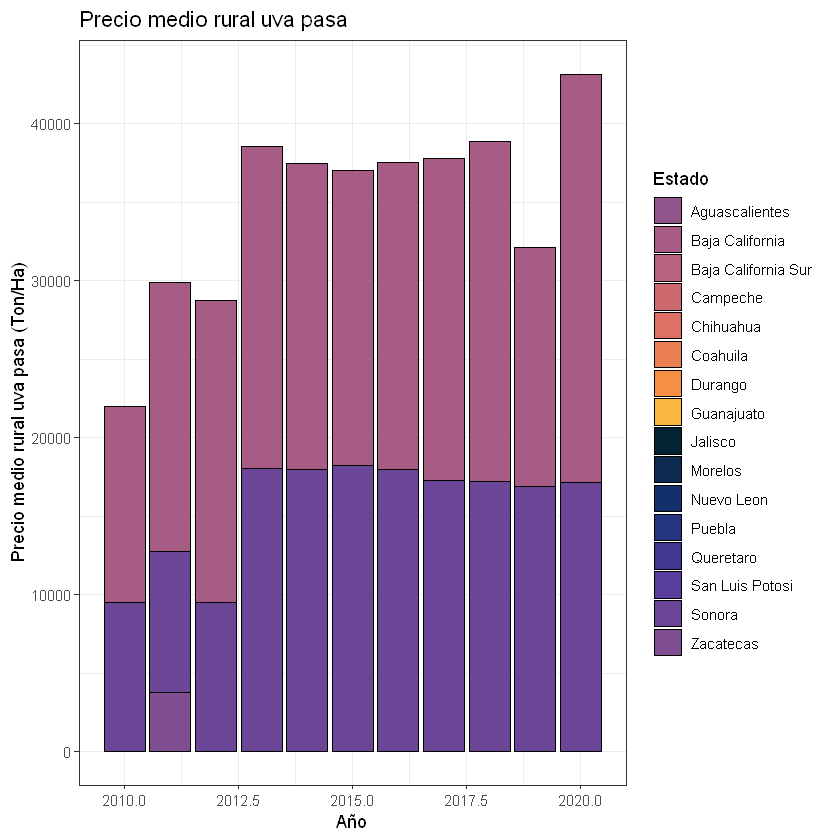

```R
library("ggplot2")
```


```R
library("colormap")
```

    Warning message:
    "package 'colormap' was built under R version 3.6.3"


```R
options(scipen=999)
```


```R
#Precio medio rural uva fruta
precio_fruta <- read.csv("C://Users/dolce/OneDrive/Documentos/Precio_fruta.csv")
head(precio_fruta)
```


<table>
<thead><tr><th scope=col>Estado</th><th scope=col>Año</th><th scope=col>Preciofruta</th></tr></thead>
<tbody>
	<tr><td>Aguascalientes     </td><td>2010               </td><td>    0.00           </td></tr>
	<tr><td>Baja California    </td><td>2010               </td><td> 7317.01           </td></tr>
	<tr><td>Baja California Sur</td><td>2010               </td><td>10000.00           </td></tr>
	<tr><td>Campeche           </td><td>2010               </td><td> 7000.00           </td></tr>
	<tr><td>Chihuahua          </td><td>2010               </td><td>    0.00           </td></tr>
	<tr><td>Coahuila           </td><td>2010               </td><td>10497.46           </td></tr>
</tbody>
</table>


```R
precio_fruta2 <- ggplot(precio_fruta, aes(x = Año, y = Preciofruta,  fill = Estado)) + 
  geom_col(color = "black") +  scale_fill_manual(values=c("#90548bff", "#a65c85ff", "#b8627dff", "#cc6a70ff",
                                                          "#de7065ff", "#eb8055ff", "#f68f46ff", "#f9b641ff",
                                                          "#042333ff", "#0c2a50ff", "#13306dff", "#253582ff",
                                                          "#403891ff","#593d9cff", "#6b4596ff", "#7e4e90ff",
                                                          "#90548bff", "#a65c85ff", "#b8627dff", "#cc6a70ff",
                                                          "#de7065ff", "#eb8055ff", "#f68f46ff", "#f9b641ff")) 
```


```R
precio_fruta2
```


    

    


```R
precio_fruta3 <- precio_fruta2 + theme (text = element_text(size=12)) + ggtitle ("Precio medio rural uva fruta") +
labs(x = "Año",y = "Precio medio rural uva fruta ($/Ton)") +
theme_bw()
```


```R
precio_fruta3
```


    

    


```R
ggsave("precio_fruta3.pdf")
```

    Saving 6.67 x 6.67 in image
    


```R
#Precio medio rural uva industrial
precio_industrial <- read.csv("C://Users/dolce/OneDrive/Documentos/Precio_industrial.csv")
head(precio_industrial)
```


<table>
<thead><tr><th scope=col>Estado</th><th scope=col>Año</th><th scope=col>Precio_indust</th></tr></thead>
<tbody>
	<tr><td>Aguascalientes     </td><td>2010               </td><td> 3225.74           </td></tr>
	<tr><td>Baja California    </td><td>2010               </td><td>10025.43           </td></tr>
	<tr><td>Baja California Sur</td><td>2010               </td><td>    0.00           </td></tr>
	<tr><td>Campeche           </td><td>2010               </td><td>    0.00           </td></tr>
	<tr><td>Chihuahua          </td><td>2010               </td><td> 2800.00           </td></tr>
	<tr><td>Coahuila           </td><td>2010               </td><td> 5500.00           </td></tr>
</tbody>
</table>


```R
precio_industrial2 <- ggplot(precio_industrial, aes(x = Año, y = Precio_indust,  fill = Estado)) + 
  geom_col(color = "black") +  scale_fill_manual(values=c("#90548bff", "#a65c85ff", "#b8627dff", "#cc6a70ff",
                                                          "#de7065ff", "#eb8055ff", "#f68f46ff", "#f9b641ff",
                                                          "#042333ff", "#0c2a50ff", "#13306dff", "#253582ff",
                                                          "#403891ff","#593d9cff", "#6b4596ff", "#7e4e90ff",
                                                          "#90548bff", "#a65c85ff", "#b8627dff", "#cc6a70ff",
                                                          "#de7065ff", "#eb8055ff", "#f68f46ff", "#f9b641ff")) 
```


```R
precio_industrial2
```


    

    


```R
precio_industrial3 <- precio_industrial2 + theme (text = element_text(size=12)) + ggtitle ("Precio medio rural uva industrial") +
labs(x = "Año",y = "Precio medio rural uva industrial (Ton/Ha)") +
theme_bw()
```


```R
precio_industrial3
```


    

    


```R
ggsave("precio_industrial3.pdf")
```

    Saving 6.67 x 6.67 in image
    


```R
#Precio medio rural uva pasa
precio_pasa <- read.csv("C://Users/dolce/OneDrive/Documentos/Precio medio rural/Precio_pasa.csv")
head(precio_pasa)
```


<table>
<thead><tr><th scope=col>Estado</th><th scope=col>Año</th><th scope=col>Precio_pasa</th></tr></thead>
<tbody>
	<tr><td>Aguascalientes     </td><td>2010               </td><td>    0.00           </td></tr>
	<tr><td>Baja California    </td><td>2010               </td><td>12478.37           </td></tr>
	<tr><td>Baja California Sur</td><td>2010               </td><td>    0.00           </td></tr>
	<tr><td>Campeche           </td><td>2010               </td><td>    0.00           </td></tr>
	<tr><td>Chihuahua          </td><td>2010               </td><td>    0.00           </td></tr>
	<tr><td>Coahuila           </td><td>2010               </td><td>    0.00           </td></tr>
</tbody>
</table>


```R
precio_pasa2 <- ggplot(precio_pasa, aes(x = Año, y = Precio_pasa,  fill = Estado)) + 
  geom_col(color = "black") +  scale_fill_manual(values=c("#90548bff", "#a65c85ff", "#b8627dff", "#cc6a70ff",
                                                          "#de7065ff", "#eb8055ff", "#f68f46ff", "#f9b641ff",
                                                          "#042333ff", "#0c2a50ff", "#13306dff", "#253582ff",
                                                          "#403891ff","#593d9cff", "#6b4596ff", "#7e4e90ff",
                                                          "#90548bff", "#a65c85ff", "#b8627dff", "#cc6a70ff",
                                                          "#de7065ff", "#eb8055ff", "#f68f46ff", "#f9b641ff")) 
```


```R
precio_pasa2
```


    

    


```R
precio_pasa3 <- precio_pasa2 + theme (text = element_text(size=12)) + ggtitle ("Precio medio rural uva pasa") +
labs(x = "Año",y = "Precio medio rural uva pasa (Ton/Ha)") +
theme_bw()
```


```R
precio_pasa3
```


    

    


```R
ggsave("precio_pasa3.pdf")
```

    Saving 6.67 x 6.67 in image
    

