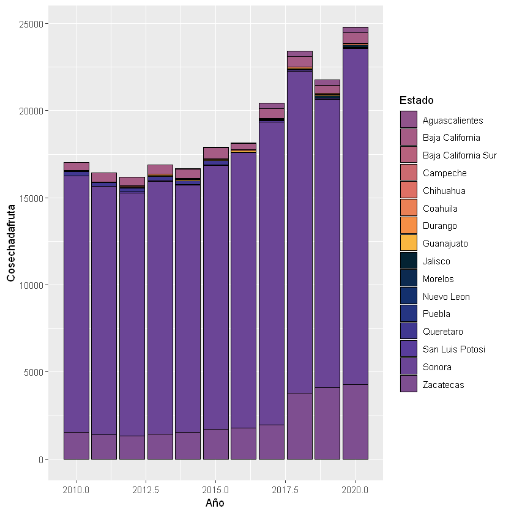
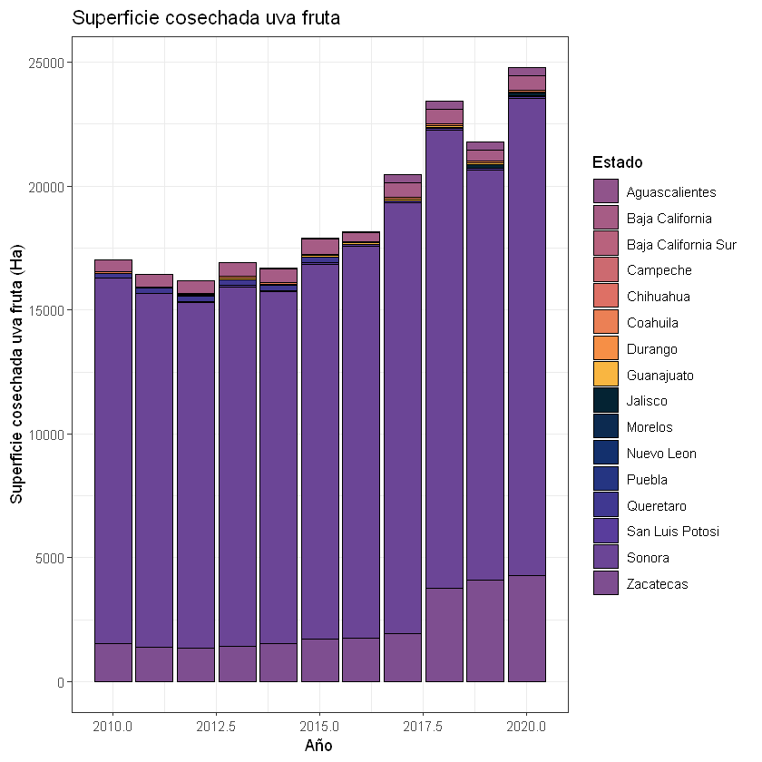
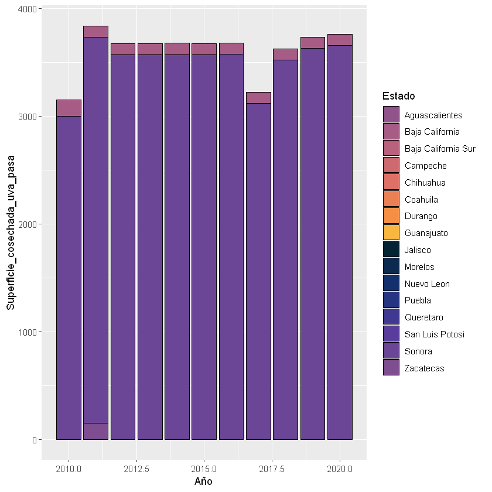
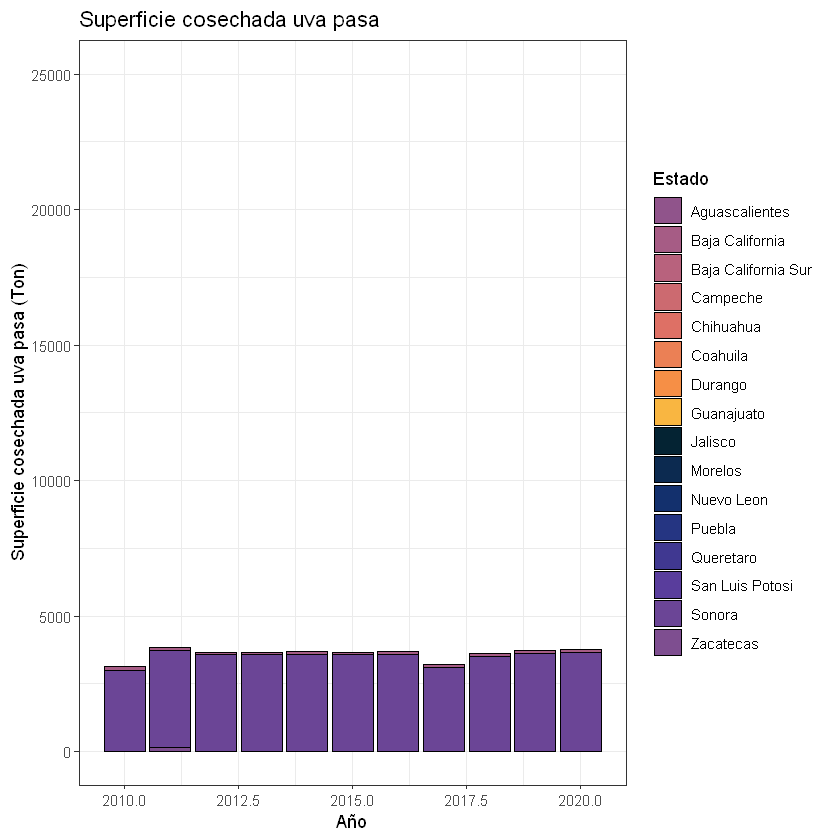
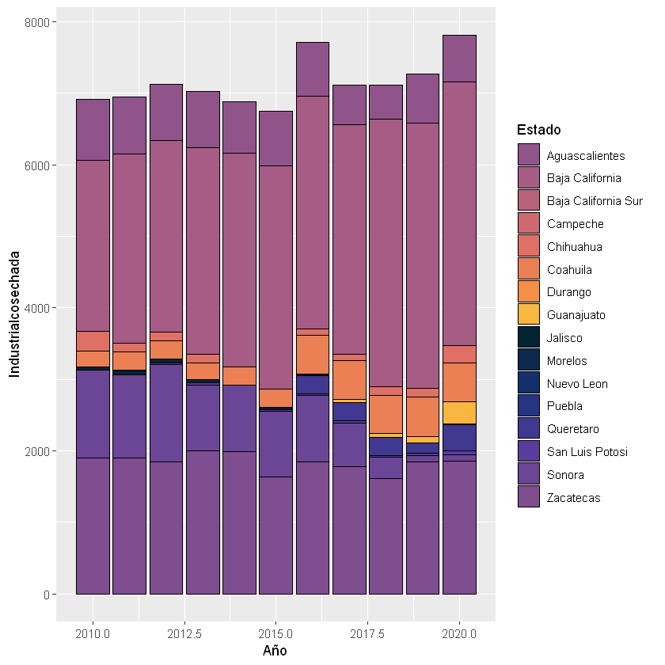
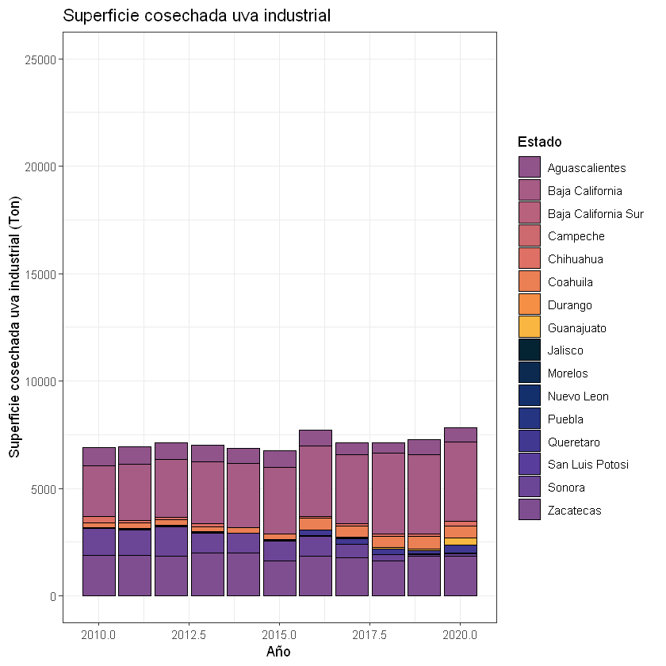

```R
library("ggplot2")
```


```R
library("colormap")
```

    Warning message:
    "package 'colormap' was built under R version 3.6.3"


```R
#Superficie cosechada uva fruta
cosechada_fruta <- read.csv("C://Users/dolce/OneDrive/Documentos/Cosechafruta.csv")
head(cosechada_fruta)
```


<table>
<thead><tr><th scope=col>Estado</th><th scope=col>Año</th><th scope=col>Cosechadafruta</th></tr></thead>
<tbody>
	<tr><td>Aguascalientes     </td><td>2010               </td><td>  0.0              </td></tr>
	<tr><td>Baja California    </td><td>2010               </td><td>481.2              </td></tr>
	<tr><td>Baja California Sur</td><td>2010               </td><td>  7.0              </td></tr>
	<tr><td>Campeche           </td><td>2010               </td><td> 10.0              </td></tr>
	<tr><td>Chihuahua          </td><td>2010               </td><td>  0.0              </td></tr>
	<tr><td>Coahuila           </td><td>2010               </td><td> 52.0              </td></tr>
</tbody>
</table>


```R
cosechada_fruta2 <- ggplot(cosechada_fruta, aes(x = Año, y = Cosechadafruta,  fill = Estado)) + 
  geom_col(color = "black") +  scale_fill_manual(values=c("#90548bff", "#a65c85ff", "#b8627dff", "#cc6a70ff",
                                                          "#de7065ff", "#eb8055ff", "#f68f46ff", "#f9b641ff",
                                                          "#042333ff", "#0c2a50ff", "#13306dff", "#253582ff",
                                                          "#403891ff","#593d9cff", "#6b4596ff", "#7e4e90ff",
                                                          "#90548bff", "#a65c85ff", "#b8627dff", "#cc6a70ff",
                                                          "#de7065ff", "#eb8055ff", "#f68f46ff", "#f9b641ff")) 
```


```R
cosechada_fruta2
```


    

    


```R
cosechada_fruta3 <- cosechada_fruta2 + theme (text = element_text(size=12)) + ggtitle ("Superficie cosechada uva fruta") +
labs(x = "Año",y = "Superficie cosechada uva fruta (Ha)") +
theme_bw()
```


```R
cosechada_fruta3
```


    

    


```R
ggsave("cosechada_fruta3.pdf")
```

    Saving 6.67 x 6.67 in image
    


```R
#Cosechada uva pasa
cosechada_pasa <- read.csv("C://Users/dolce/OneDrive/Documentos/Cosechadapasa.csv")
head(cosechada_pasa)
```


<table>
<thead><tr><th scope=col>Estado</th><th scope=col>Año</th><th scope=col>Superficie_cosechada_uva_pasa</th></tr></thead>
<tbody>
	<tr><td>Aguascalientes     </td><td>2010               </td><td>  0                </td></tr>
	<tr><td>Baja California    </td><td>2010               </td><td>151                </td></tr>
	<tr><td>Baja California Sur</td><td>2010               </td><td>  0                </td></tr>
	<tr><td>Campeche           </td><td>2010               </td><td>  0                </td></tr>
	<tr><td>Chihuahua          </td><td>2010               </td><td>  0                </td></tr>
	<tr><td>Coahuila           </td><td>2010               </td><td>  0                </td></tr>
</tbody>
</table>


```R
cosechada_pasa <- read.csv("C://Users/dolce/OneDrive/Documentos/Cosechadapasa.csv")
head(cosechada_pasa) 
```


```R
cosechada_pasa2
```


    

    


```R
cosechada_pasa4 <- cosechada_pasa2 + theme (text = element_text(size=12)) + ggtitle ("Superficie cosechada uva pasa") +
labs(x = "Año",y = "Superficie cosechada uva pasa (Ton)") + scale_y_continuous(limit = c(0,25000)) + theme_bw()
```


```R
cosechada_pasa4
```


    

    


```R
ggsave("cosechada_pasa6.pdf")
```

    Saving 6.67 x 6.67 in image
    


```R
#Superficie cosechada uva industrial
cosechada_industrial <- read.csv("C://Users/dolce/OneDrive/Documentos/Industrialcosechado.csv")
head(cosechada_industrial)
```


<table>
<thead><tr><th scope=col>Estado</th><th scope=col>Año</th><th scope=col>Industrialcosechada</th></tr></thead>
<tbody>
	<tr><td>Aguascalientes     </td><td>2010               </td><td> 853.00            </td></tr>
	<tr><td>Baja California    </td><td>2010               </td><td>2386.14            </td></tr>
	<tr><td>Baja California Sur</td><td>2010               </td><td>   0.00            </td></tr>
	<tr><td>Campeche           </td><td>2010               </td><td>   0.00            </td></tr>
	<tr><td>Chihuahua          </td><td>2010               </td><td> 276.00            </td></tr>
	<tr><td>Coahuila           </td><td>2010               </td><td> 230.00            </td></tr>
</tbody>
</table>


```R
cosechada_industrial2 <- ggplot(cosechada_industrial, aes(x = Año, y = Industrialcosechada,  fill = Estado)) + 
  geom_col(color = "black") +  scale_fill_manual(values=c("#90548bff", "#a65c85ff", "#b8627dff", "#cc6a70ff",
                                                          "#de7065ff", "#eb8055ff", "#f68f46ff", "#f9b641ff",
                                                          "#042333ff", "#0c2a50ff", "#13306dff", "#253582ff",
                                                          "#403891ff","#593d9cff", "#6b4596ff", "#7e4e90ff",
                                                          "#90548bff", "#a65c85ff", "#b8627dff", "#cc6a70ff",
                                                          "#de7065ff", "#eb8055ff", "#f68f46ff", "#f9b641ff")) 
```


```R
cosechada_industrial2
```


    

    


```R
cosechada_industrial3 <- cosechada_industrial2 + theme (text = element_text(size=12)) + ggtitle ("Superficie cosechada uva industrial") +
labs(x = "Año",y = "Superficie cosechada uva industrial (Ton)") + scale_y_continuous(limit = c(0,25000)) + theme_bw()
```


```R
cosechada_industrial3
```


    

    


```R
ggsave("cosechada_industrial3.pdf")
```

    Saving 6.67 x 6.67 in image
    
